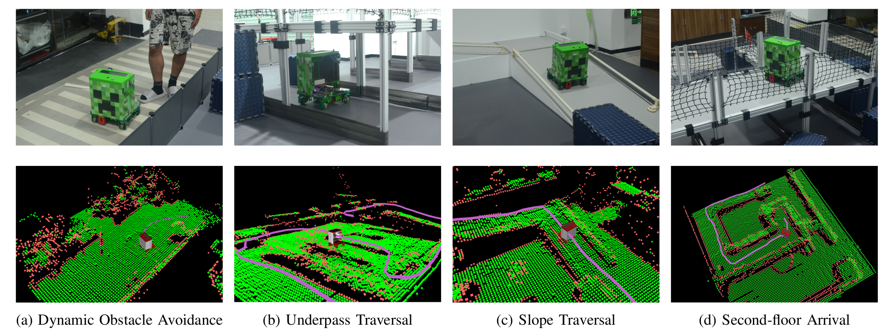
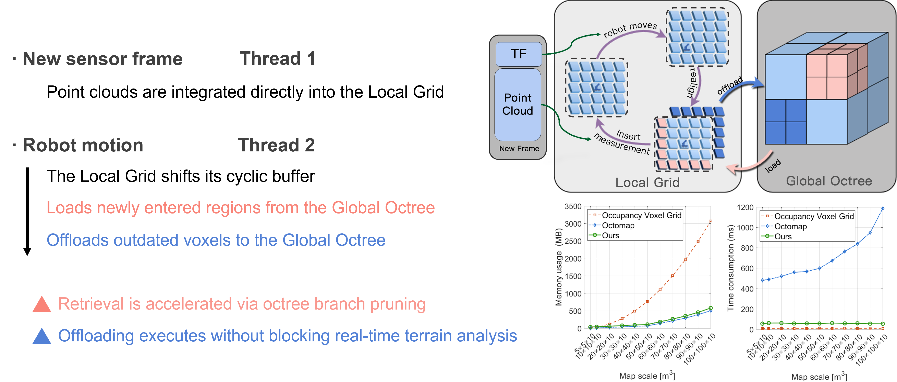

# FineNav

[](#)
[](https://opensource.org/licenses/MPL-2.0)
[](https://docs.ros.org/en/humble/)

## Notes

**Current State (Academic Reproduction):**

The code currently available in the `icra2026` branch contains the experimental implementation corresponding to our ICRA 2026 paper. It is provided for algorithm verification and academic reference. **It is not yet optimized for direct production deployment.**

**Upcoming Release (June 2026):**

We are currently conducting a comprehensive system refactoring based on **FineNav-Engine**—a dedicated C++20 development framework for robotics navigation. This upcoming release will be fully optimized for direct production deployment and accompanied by detailed documentation.

If you are interested in our work, please ⭐Star this repository to receive updates on the upcoming full release ;D

## Table of Contents

- [What is FineNav?](#what-is-finenav)
- [Why FineNav?](#why-finenav)
- [How to use FineNav](#how-to-use-finenav)
- [Citation](#citation)

## What is FineNav?

FineNav is a navigation framework tailored for ground robots operating in unstructured 3D environments. At its core is a novel hierarchical mapping system featuring a cache-memory-like mechanism. This architecture achieves a strict balance between low-latency real-time perception (for dynamic obstacle avoidance and terrain analysis) and scalable global storage (for large-scale 3D reasoning).


## Why FineNav?

### Versatile in various scenarios

The FineNav navigation framework is capable of dealing with various scenarios in unstructured environments within a unified pipeline, including:


### Low-latency perception with scalable reasoning

The core mapping system leverages a hierarchical architecture to balance latency and storage:
* **Ring-buffer based Local Grid:** Achieves $O(1)$ spatial shifts, enabling high-rate map updates and low-latency reactive perception.
* **Global OctoMap:** Maintains a persistent, memory-efficient 3D representation for large-scale spatial reasoning and cross-floor path planning.

The interaction mechanism between both maps is specifically designed to mirror a **cache-memory** model, effectively decoupling the real-time perception pipeline from costly global map updates:


### High usability and extensibility

FineNav is built upon a highly modular architecture of reusable components, ensuring that each module can be replaced or reconfigured independently.
Specifically, terrain analysis is tightly coupled with locomotion capability and is therefore exposed as a plugin. Developers can dynamically load custom analyzers without modifying the core system.

## How to use FineNav

The code currently available in the `icra2026` branch contains the experimental implementation corresponding to our ICRA 2026 paper. It is provided for algorithm verification and academic reference. **It is not yet optimized for direct production deployment.**
The production-ready version based on FineNav-Engine will be released soon.

## Citation

If you find this work helpful in your research, please cite our paper:

```bibtex
@inproceedings{wang2026finenav,
  title={FINENAV: A Versatile Framework Enhancing Ground Robot Navigation in Unstructured Environment},
  author={Wang, Jinghui and Wang, Chenyang and Cao, Yuxuan and Sun, Zelong and Xi, Wang and He, Jianping},
  booktitle={IEEE International Conference on Robotics and Automation (ICRA)},
  year={2026}
}