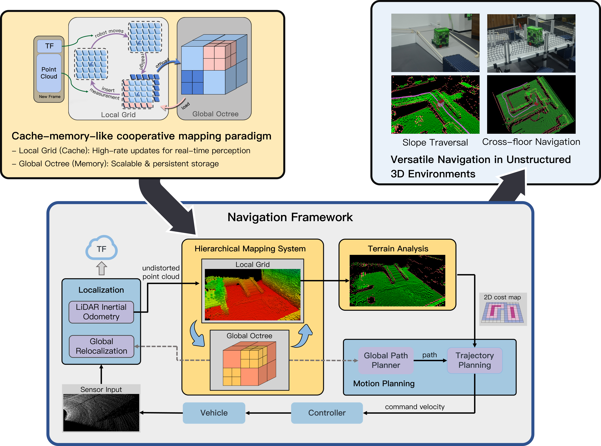

# FineNav

[](#)
[](https://opensource.org/licenses/MPL-2.0)
[](https://docs.ros.org/en/humble/)

## Notes

**Current State (Academic Reproduction):**

The code currently available in the `icra2026` branch contains the experimental implementation corresponding to our ICRA 2026 paper. It is provided for algorithm verification and academic reference. **It is not yet optimized for direct production deployment.**


**Upcoming Release (June 2026):**

We are currently conducting a comprehensive system refactoring based on **FineNav-Engine**—a dedicated C++20 development framework for robotics navigation. This upcoming release will be fully optimized for direct production deployment and accompanied by detailed documentation.


If you are interested in our work, please Star this repository to receive updates on the upcoming full release ;D

---

## Table of Contents

- [What is FineNav?](#what-is-finenav)
- [Why FineNav?](#why-finenav)
- [How to use FineNav](#how-to-use-finenav)
- [Citation](#citation)

## What is FineNav?

FineNav is a navigation framework tailored for ground robots to navigate in unstructured environment. It feaures on its cache-memory-like hierarchical mapping system, which acchieve a favorable balance between low-latency real-time perception (for dynamic obtacle update and terrain analysis), and scalable global storage (for large-scale 3D reasoning).




## Why FineNav?

1. scenarios versatiliy

2. performance advantage
   
   ring-buffer based local grid & octomap

3. usibility (terrain anlyzer plugins)

## How to use FineNav

The experimental code corresponding to our paper is available in the `icra2026` branch. The complete source code for practical deployment will be officially released in June 2026, coinciding with the ICRA conference.


## Citation

If you find this work helpful in your research, please cite our paper:

```bibtex
@inproceedings{wang2026finenav,
  title={FINENAV: A Versatile Framework Enhancing Ground Robot Navigation in Unstructured Environment},
  author={Wang, Jinghui and Wang, Chenyang and Cao, Yuxuan and Sun, Zelong and Xi, Wang and He, Jianping},
  booktitle={IEEE International Conference on Robotics and Automation (ICRA)},
  year={2026}
}
```