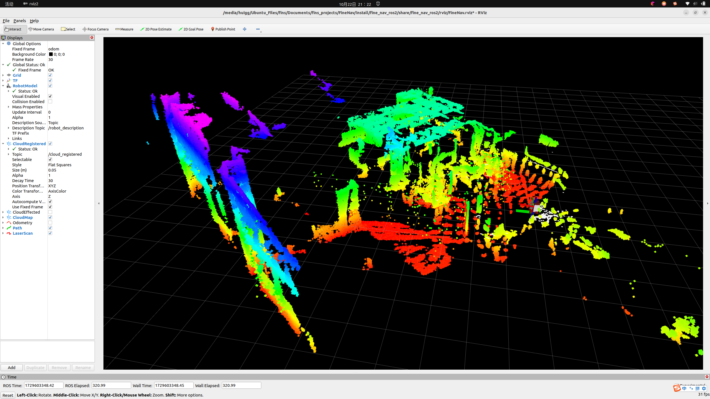

# FineNav2D

## How to use

1. clone the repository
   
```shell
git clone https://gitee.com/huigg-practice/FineNav2D.git
# Make sure you are in the root directory of the project
git submodule init
git submodule update --remote --recursive # since the reporsitry is under development, you need to get the lastest branch in remote.
```

2. build the project

   
FineNav2D rely on several extern packages like hardware driver, LIO etc. All extern packages are managed in `<PROJECT_DIR>/FinNav_ExternPack`. You can see them in `<PROJECT_DIR>/.gitmodules`. You should make sure that the packages you want to use share the same ROS distribution. **It's crucial** for the project to build properly.
   
```shell
# e.g. If you want to develop in ROS2, you should make sure every package in the extern package is ROS2 version
# Change directory to FinNav_ExternPack/Driver/Livox_Mid360
git branch
# and then you can see the current branch
# if you want to change the branch
git checkout <TARGET_BRANCH>
```

```shell
 colcon build
```

If your device crash in compiling, then try to compile packages one by one by inpu
```shell
colcon build --executor sequential
```

3. launch

```shell
# Make sure you are in the root directory of the project
source install/fine_nav_ros2/share/fine_nav_ros2/local_setup.bash
```
Example: Bring up FineNav2D with Livox Mid-360 and Fast-LIO

```shell
# Check your ethernet interface
ifconfig
# Set the static IP address of your ethernet interface
# The default ipv4 address is 192.168.1.50, you can change it in <PROJECT_DIR>/fn_bringup/config/MID360_config.yaml
sudo ifconfig <interface> <ip>
# Launch FineNav2D
ros2 launch fine_nav2d_bringup bringup_nav2_real.launch.py \
lidar_type:=livox \
enable_recorder:=false \
lio_type:=fast_lio \
enable_rviz:=true
```
If everything goes well, you will see the following result:
